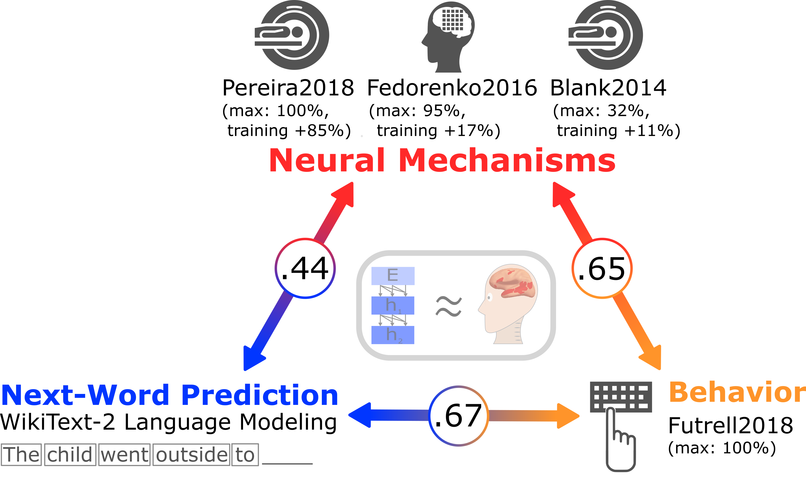

# The neural architecture of language: Integrative modeling converges on predictive processing 

Code accompanying the paper 
[The neural architecture of language: Integrative modeling converges on predictive processing](https://www.biorxiv.org/content/10.1101/2020.06.26.174482v3) by Schrimpf, Blank, Tuckute, Kauf, Hosseini, Kanwisher, Tenenbaum, and Fedorenko.



Large-scale evaluation of neural network language models 
as predictive models of human language processing.
This pipeline compares dozens of state-of-the-art models and 4 human datasets (3 neural, 1 behavioral).
It builds on the [Brain-Score](www.Brain-Score.org) framework and can easily be extended with new models and datasets.

## Installation
```bash
git clone https://github.com/mschrimpf/neural-nlp.git
cd neural-nlp
pip install -e .
```
You might have to install nltk by hand / with conda.

## Run
To score gpt2-xl on the Blank2014fROI-encoding benchmark:

```bash
python neural_nlp run --model gpt2-xl --benchmark Blank2014fROI-encoding --log_level DEBUG
```

Other available benchmarks are e.g. Pereira2018-encoding (takes a while to compute), and Fedorenko2016v3-encoding.

You can also specify different models to run -- 
note that some of them require additional download of weights (run `ressources/setup.sh` for automated download).

## Citation
If you use this work, please cite
```
@article{Schrimpf2020,
	author = {Schrimpf, Martin and Blank, Idan and Tuckute, Greta and Kauf, Carina and Hosseini, Eghbal A. and Kanwisher, Nancy and Tenenbaum, Joshua and Fedorenko, Evelina},
	title = {Artificial Neural Networks Accurately Predict Language Processing in the Brain},
	year = {2020},
	doi = {10.1101/2020.06.26.174482},
	elocation-id = {2020.06.26.174482},
	publisher = {Cold Spring Harbor Laboratory},
	abstract = {The ability to share ideas through language is our species{\textquoteright} signature cognitive skill, but how this feat is achieved by the brain remains unknown. Inspired by the success of artificial neural networks (ANNs) in explaining neural responses in perceptual tasks (Kell et al., 2018; Khaligh-Razavi \&amp; Kriegeskorte, 2014; Schrimpf et al., 2018; Yamins et al., 2014; Zhuang et al., 2017), we here investigated whether state-of-the-art ANN language models (e.g. Devlin et al., 2018; Pennington et al., 2014; Radford et al., 2019) capture human brain activity elicited during language comprehension. We tested 43 language models spanning major current model classes on three neural datasets (including neuroimaging and intracranial recordings) and found that the most powerful generative transformer models (Radford et al., 2019) accurately predict neural responses, in some cases achieving near-perfect predictivity relative to the noise ceiling. In contrast, simpler word-based embedding models (e.g. Pennington et al., 2014) only poorly predict neural responses (\&lt;10\% predictivity). Models{\textquoteright} predictivities are consistent across neural datasets, and also correlate with their success on a next-word-prediction task (but not other language tasks) and ability to explain human comprehension difficulty in an independent behavioral dataset. Intriguingly, model architecture alone drives a large portion of brain predictivity, with each model{\textquoteright}s untrained score predictive of its trained score. These results support the hypothesis that a drive to predict future inputs may shape human language processing, and perhaps the way knowledge of language is learned and organized in the brain. In addition, the finding of strong correspondences between ANNs and human representations opens the door to using the growing suite of tools for neural network interpretation to test hypotheses about the human mind.Competing Interest StatementThe authors have declared no competing interest.},
	URL = {https://www.biorxiv.org/content/early/2020/06/27/2020.06.26.174482},
	eprint = {https://www.biorxiv.org/content/early/2020/06/27/2020.06.26.174482.full.pdf},
	journal = {bioRxiv}
}

```
